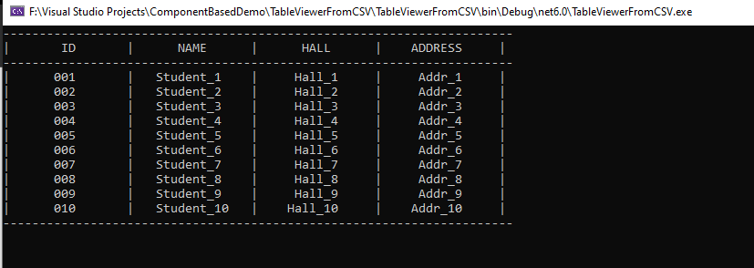

# Console based Table Viewer Component

## How to run:
This project is based on Dot Net 6.0 framework. So, the prerequistion is that your computer must have net6.0 and related SDK. The easiest way to run: 

1. Open TableViewerFromCSV.sln or TableViewerFromJSON.sln using Microsoft Visual Studio (preferred 2022 version)
2. In Visual Studio, press run button from the top bar or simply press F5 from the keyboard.
3. Output will be shown in console.

### Demo Output

## Description
This project tries to demonstrate Component Based Software Engineering architecture. A reusable component is written to view data into a table format on console.
###
The source code of this component can be found in "TableViewer/TableViewerComponent" folder. To ensure the reusability, the **dll** of this component is used in two different projects named "TableViewerFromCSV" and "TableViewerFromJSON". They use **TableViewerComponent.dll** to render their respective data into a table format. The demonstration data file can be found in "Files" folder situated in each project.

## Component Interfaces
### Provides Interface:
There is a method called **ShowTable()** acts like a Provides interface. It is responsible for rendering the table.
### Requires Interface
There is an Interface called **ITableData** provides the functionality as a Requires interface. Those who uses this component should implement this interface to format their data according to the need of TableViewerComponent.